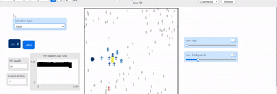

# VIP Security Protective Formation Strategy (ABM)

## Project Overview
This project presents an **Agent-Based Model (ABM)** designed to evaluate the effectiveness of protective security formations in high-density, dynamic crowd environments. Developed as part of the **ABM Theory (Spring 2026)** course at the National University of Technology, the simulation explores the trade-offs between security reacts, crowd density, and non-hostile stressors like media presence.

  

### The Problem
Traditional security models often ignore "soft stressors." This simulation introduces **Media Scrums** and **Fan Interactions** to see how non-hostile agents can inadvertently create "security gaps" that hostile threats exploit.

---

## Key Features

* **Multi-Agent Ecosystem:** * **VIP Convoy:** Principals with health-tracking and goal-directed locomotion.
    * **Layered Security:** Bodyguards split into **Inner Circle** (Shields) and **Outer Perimeter** (Interceptors).
    * **Stressor Agents:** Reporters with camera-flash effects and Fans who "gift" items to guards.
    * **Threat Agents:** Red agents that use aggression-weighted pursuit logic.
* **Dynamic Formation Logic:** Real-time rotation matrix implementation allows the security shell to rotate based on the VIP's heading.
* **Crowd Physics:** Repulsion vectors simulate "dragging back" the crowd to maintain a 3-patch security bubble.
* **Experimental Suite:** Built-in reporters for **BehaviorSpace** to track Survival Rates, Formation Integrity (FI), and Neutralization Counts.

---

## Emergent Phenomena & Analysis

### 1. The "Gift Saturation" Effect
A primary discovery of this model is the **Saturation Point**. When guards accept gifts from fans, they enter an "Encumbered State," slowing their movement by 60% and disabling their ability to intercept threats. In high-density crowds, this creates an emergent vulnerability where the VIP is surrounded by non-reactive guards.

### 2. Sensitivity Analysis
The model was tested against varying **Detection Radii**. We found that a radius of **8–12 patches** is the "Goldilocks Zone"—balancing reactive capability without prematurely breaking formation integrity.

---

## How to Run

1.  **Requirement:** Install [NetLogo 6.3.0](https://ccl.northwestern.edu/netlogo/download.shtml).
2.  **Clone Repo:** `git clone https://github.com/YOUR_USERNAME/VIP-Security-ABM-NetLogo.git`
3.  **Execute:**
    * Open `VIP_Security_Experimental.nlogo`.
    * Adjust the **Sliders** (`num-vips`, `num-bodyguards`, `num-civilians`).
    * Press `Setup` and then `Go`.
4.  **Analyze:** Open the `View Plots` window to see real-time Formation Integrity and Survival data.

---

## Experimental Results
The data included in the final report was generated via a **BehaviorSpace parameter sweep** (500 iterations). 

| Scenario | Crowd Size | Guard Count | Survival Rate |
| :--- | :--- | :--- | :--- |
| Low Stress | 50 | 4 | 98.2% |
| High Stress | 300 | 8 | 62.1% |

---

---
*Disclaimer: This model is for academic simulation purposes and uses simplified Social Force Model (SFM) principles.*
